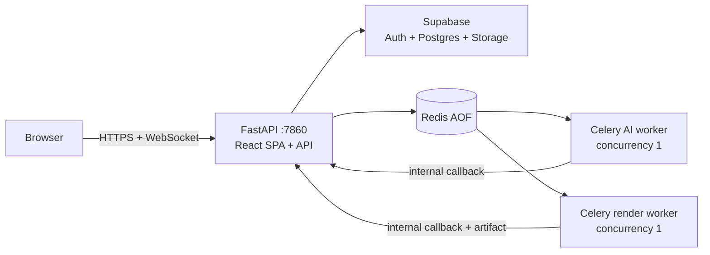

# Manim Agent

Manim Agent biến một ý tưởng giáo dục thành storyboard, mã Manim có vòng review, video từng cảnh và video hoàn chỉnh. Frontend React cung cấp HITL; FastAPI quản lý quyền truy cập và trạng thái; Celery chạy AI/review/render; Supabase lưu dữ liệu và video bền vững.

## Kiến trúc triển khai

Bản phát hành đầu tiên dùng **một Hugging Face Docker Space**:



Monorepo vẫn giữ ranh giới rõ:

| Thư mục | Trách nhiệm |
| --- | --- |
| `frontend/` | React/Vite, Supabase Auth, REST và WebSocket cùng origin |
| `backend/` | FastAPI, authorization, Supabase, HITL, cache và điều phối queue |
| `ai_core/` | LLM, review loop, TTS, Manim và Celery workers |
| `shared/` | Pydantic contracts dùng chung, không chứa persistence/runtime |
| `deploy/huggingface/` | Supervisor, Redis và entrypoint cho Space |

Một Space phù hợp với giới hạn cổng/outbound của Hugging Face và loại bỏ nhu cầu chia sẻ filesystem giữa nhiều Space. Đây là profile **protected/private, single-tenant, trusted-input**: mã Python Manim sinh tự động không chạy trong sandbox bảo mật hoàn chỉnh. Không dùng profile này làm dịch vụ thực thi code công khai cho nhiều tenant. Lộ trình tách ba dịch vụ được mô tả trong [kiến trúc](docs/ARCHITECTURE.md).

## Chạy local

Yêu cầu: Docker + Docker Compose, Node.js 22 nếu chạy frontend dev, Python 3.12 nếu chạy service trực tiếp, một Supabase project và Google API key cho luồng AI thật.

```bash
cp backend/.env.example backend/.env
cp ai_core/.env.example ai_core/.env
cp frontend/.env.example frontend/.env
```

Điền cấu hình cần thiết, sau đó:

```bash
bash backend/supabase/validate_migrations.sh
docker compose up --build
```

Ở terminal khác:

```bash
cd frontend
npm ci
npm run dev
```

- Frontend: `http://localhost:5173`
- Backend OpenAPI: `http://localhost:8000/docs`
- Backend liveness/readiness: `/health`, `/ready`
- AI Core chỉ được expose trong mạng Compose tại cổng `8001`

`AUTH_MODE=off` và `VITE_AUTH_MODE=off` chỉ dành cho local. Production bắt buộc JWT.

## Kiểm tra trước khi phát hành

```bash
make check       # lint + 3 test suites + frontend build + migration replay
make audit       # Python locks + npm vulnerability audit
make image       # build image một-Space ở local
```

Dependency Python production/dev được khóa bằng hash trong `requirements*.lock`; frontend dùng `package-lock.json`. `backend/supabase/migrations/*.sql` là nguồn schema duy nhất có thể deploy; `init_schema.sql` chỉ là marker tương thích và không được chạy.

## Deploy

1. Tạo Supabase production project và Hugging Face Docker Space `Private` hoặc `Protected`, dùng hardware always-on và persistent storage gắn tại `/data`.
2. Cấu hình Space Variables/Secrets theo [hướng dẫn deployment](docs/DEPLOYMENT.md).
3. Tạo GitHub Environment `production`, thêm `HF_SPACE_ID`, `SUPABASE_PROJECT_REF` và ba deployment secrets.
4. Bảo vệ nhánh `main` bằng toàn bộ required checks của workflow `CI`.
5. Merge/push vào `main`. CD chỉ chạy khi CI của đúng commit thành công, push migration trước rồi đồng bộ commit đó sang Space.

Các tên key hiện hành được ưu tiên:

- Browser build: `VITE_SUPABASE_PUBLISHABLE_KEY` (`sb_publishable_*`).
- Backend runtime: `SUPABASE_SECRET_KEY` (`sb_secret_*`).
- Legacy `anon`/`service_role` vẫn được chấp nhận trong giai đoạn chuyển đổi.
- JWT ES256/RS256 được xác minh qua Supabase JWKS; chỉ cấu hình `SUPABASE_JWT_SECRET` khi còn dùng HS256 legacy.

Không commit `.env`, service key hoặc Google key. File `frontend/.env` cũ đã được loại khỏi tracking; production build cũng không đọc file `.env` của developer.

## Tài liệu

- [Mục lục tài liệu](docs/README.md)
- [Kiến trúc và state machine](docs/ARCHITECTURE.md)
- [Deployment Hugging Face + Supabase](docs/DEPLOYMENT.md)
- [CI/CD](docs/CI_CD.md)
- [Database và migration](docs/DATABASE.md)
- [Vận hành và khôi phục](docs/OPERATIONS.md)
- [Security model](SECURITY.md)
- [Frontend API contract](docs/FRONTEND_API.md)
