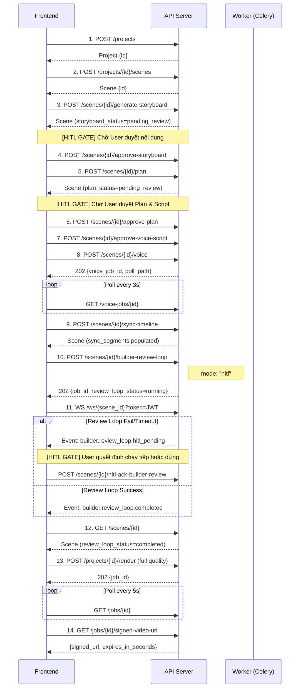

# Frontend Integration Guide — Manim Agent API

> **Base URL**: `https://<API_HOST>/v1`
> **Interactive Docs**: `/docs` (Swagger) · `/scalar` (Premium UI) · `/openapi.json` (Raw spec)

---

## 1. Authentication

Hệ thống sử dụng **Supabase Auth** với JWT (HS256).

| Header | Value |
|--------|-------|
| `Authorization` | `Bearer <SUPABASE_JWT>` |

**Lấy token từ Supabase JS SDK:**
```javascript
const { data: { session } } = await supabase.auth.getSession();
const token = session.access_token;

// Gắn vào mọi request
const headers = { Authorization: `Bearer ${token}` };
```

> **Lưu ý**: Khi `AUTH_MODE=off` (chỉ dev), server tự dùng user mặc định — không cần header.

---

## 2. Quy trình sản xuất video (Production Pipeline)



---

## 3. API Reference — Tất cả Endpoints

### 3.1 Projects

#### `POST /v1/projects` — Tạo dự án mới
- **Rate limit**: 2/minute
- **Request Body**:
```json
{
  "title": "Binary Search Visualization",
  "description": "Giải thích cách hoạt động của Binary Search",
  "source_language": "vi",
  "target_scenes": 3,
  "use_primitives": true,
  "config": {}
}
```
- **Response** `201`:
```json
{
  "id": "a1b2c3d4-...",
  "user_id": "...",
  "title": "Binary Search Visualization",
  "description": "...",
  "source_language": "vi",
  "target_scenes": 3,
  "config": {"use_primitives": true},
  "status": "draft",
  "created_at": "2026-05-05T12:00:00Z",
  "updated_at": "2026-05-05T12:00:00Z"
}
```

#### `GET /v1/projects` — Danh sách dự án
- **Pagination**: Mặc định 20 items/page. Sử dụng query params `page` và `limit`.
- **Response** `200`: `PaginatedResponse<Project>`
```json
{
  "items": [...],
  "total": 150,
  "page": 1,
  "limit": 20,
  "pages": 8
}
```

#### `GET /v1/projects/{project_id}` — Chi tiết dự án
- **Response** `200`: `Project`
- **Error** `404`: Project không tồn tại hoặc không thuộc user

#### `PATCH /v1/projects/{project_id}` — Cập nhật dự án
- **Request Body**: `ProjectUpdate` (title, description, source_language, status, ...)
- **Response** `200`: `Project`

#### `DELETE /v1/projects/{project_id}` — Xóa dự án
- **Response** `204`: No Content

#### `GET /v1/projects/{project_id}/scenes` — Danh sách scenes
- **Pagination**: Mặc định 100 items/page.
- **Response** `200`: `PaginatedResponse<Scene>`

#### `POST /v1/projects/{project_id}/scenes` — Tạo scene mới
- **Rate limit**: 10/minute
- **Request Body**:
```json
{
  "scene_order": 0,
  "storyboard_text": null,
  "voice_script": null
}
```
- **Response** `201`: `Scene`

#### `POST /v1/projects/{project_id}/scenes/batch` — Tạo/Cập nhật hàng loạt scene
- **Request Body**: `Scene[]`
- **Response** `200`: `Scene[]`

#### `POST /v1/projects/{project_id}/approve-storyboard` — Duyệt tất cả storyboard
- **Response** `200`: `Scene[]` (tất cả scenes đã được approve)
- **Error** `409`: Có scene chưa ở trạng thái `pending_review`

#### `GET /v1/projects/{project_id}/pipeline-runs` — Lịch sử pipeline runs
- **Response** `200`: `PipelineRun[]`

---

### 3.2 Scenes — AI Pipeline

#### `GET /v1/scenes/{scene_id}` — Lấy thông tin scene
- **Response** `200`: `Scene` (xem schema bên dưới)

#### `POST /v1/scenes/{scene_id}/generate-storyboard` — Director Agent
- **Rate limit**: 5/minute · **Sync** (10-30s)
- **Request Body** (optional):
```json
{ "brief_override": "Tập trung vào phần so sánh O(n) vs O(log n)" }
```
- **Response** `200`: `Scene` với `storyboard_status = "pending_review"`
- **Errors**: `404` scene not found · `409` storyboard already approved

#### `POST /v1/scenes/{scene_id}/approve-storyboard` — Duyệt storyboard
- **Response** `200`: `Scene` với `storyboard_status = "approved"`
- **Errors**: `409` không ở trạng thái `pending_review` · `400` storyboard trống

#### `PATCH /v1/scenes/{scene_id}` — Cập nhật scene
- **Request Body**: `SceneUpdate` (scene_order, storyboard_text, voice_script, ...)
- **Response** `200`: `Scene`

#### `DELETE /v1/scenes/{scene_id}` — Xóa scene
- **Response** `204`: No Content

#### `POST /v1/scenes/{scene_id}/approve` — Duyệt storyboard (Individual)
- Tương đương với `approve-storyboard`.

#### `POST /v1/scenes/{scene_id}/plan` — Planner Agent
- **Rate limit**: 10/minute · **Sync** (10-20s)
- **Precondition**: `storyboard_status = "approved"`
- **Response** `200`: `Scene` với `plan_status = "pending_review"`, `planner_output` populated
- **Errors**: `400` storyboard chưa approved · `404` scene not found

#### `POST /v1/scenes/{scene_id}/approve-plan` — Duyệt plan
- **Response** `200`: `Scene` với `plan_status = "approved"`

#### `POST /v1/scenes/{scene_id}/approve-voice-script` — Duyệt voice script
- **Response** `200`: `Scene` với `voice_script_status = "approved"`

#### `POST /v1/scenes/{scene_id}/voice` — TTS Synthesis (Piper)
- **Async** → returns `202`
- **Request Body** (optional):
```json
{
  "voice_script_override": "Nội dung lời thoại tùy chỉnh",
  "language": "vi"
}
```
- **Response** `202`:
```json
{
  "voice_job_id": "550e8400-...",
  "status": "queued",
  "poll_path": "/v1/voice-jobs/550e8400-..."
}
```
- **Errors**: `400` thiếu text để synthesize · `400` storyboard chưa approved

#### `POST /v1/scenes/{scene_id}/sync-timeline` — Đồng bộ beats với audio
- **Preconditions**: Cần có `planner_output` và `timestamps` (TTS đã hoàn thành)
- **Response** `200`: `Scene` với `sync_segments` populated
- **Errors**: `400` thiếu plan hoặc timestamps

#### `POST /v1/scenes/{scene_id}/generate-code` — Builder Agent
- **Rate limit**: 5/minute · **Sync** (15-60s)
- **Request Body** (optional):
```json
{ "enqueue_preview": true }
```
- **Response** `200`:
```json
{
  "scene": { "...Scene object with manim_code populated..." },
  "preview_job_id": "uuid-or-null"
}
```

#### `POST /v1/scenes/{scene_id}/review-round` — Chạy 1 round review
- **Sync** (30-120s) — nặng, nên dùng `builder-review-loop` thay thế
- **Request Body** (optional):
```json
{ "preview_job_id": "uuid-of-completed-render" }
```
- **Response** `200`:
```json
{
  "static_parse_ok": true,
  "static_imports_ok": true,
  "code_review": { "passed": true, "score": 8, "feedback": "..." },
  "code_review_passed": true,
  "visual_review": { "passed": true, "score": 7, "feedback": "..." },
  "visual_review_passed": true,
  "early_stop": true,
  "metrics": {}
}
```

#### `POST /v1/scenes/{scene_id}/builder-review-loop` — Full Orchestrator
- **Rate limit**: 2/minute · **Async** → returns `202`
- **Precondition**: `storyboard_status = "approved"`
- **Request Body** (optional):
```json
{
  "mode": "auto",
  "preview_poll_timeout_seconds": 120
}
```
  - `mode`: `"auto"` (tự động pass/fail) hoặc `"hitl"` (dừng để chờ user)
- **Response** `202`:
```json
{
  "scene_id": "...",
  "job_id": "celery-task-uuid",
  "review_loop_status": "running"
}
```

#### `POST /v1/scenes/{scene_id}/hitl-ack-builder-review` — HITL Control
- Sử dụng khi `mode = "hitl"` và `review_loop_status = "hitl_pending"`
- **Request Body**:
```json
{
  "action": "continue",
  "extra_rounds": 3
}
```
  - `action`: `"continue"` (tiếp tục loop) · `"revert"` (reset về trạng thái ban đầu) · `"stop"` (dừng hẳn)
- **Response** `200`:
```json
{
  "scene": { "...updated Scene..." },
  "message": "Continued in background (job_id=...)."
}
```

---

### 3.3 Render Jobs

#### `POST /v1/projects/{project_id}/render` — Tạo render job
- **Rate limit**: 5/minute
- **Idempotency**: Gửi Header `X-Idempotency-Key` để tránh tạo job trùng lặp khi retry.
- **Request Body**:
```json
{
  "render_type": "full",
  "quality": "1080p",
  "scene_id": "uuid-of-scene",
  "webhook_url": null
}
```
  - `quality`: `"720p"` · `"1080p"` · `"4k"`
- **Response** `202`:
```json
{ "job_id": "...", "status": "queued" }
```

#### `GET /v1/jobs/{job_id}` — Trạng thái render job
- **Response** `200`:
```json
{
  "id": "...",
  "project_id": "...",
  "scene_id": "...",
  "job_type": "full",
  "render_quality": "1080p",
  "status": "rendering",
  "progress": 45,
  "logs": null,
  "asset_url": null,
  "error_code": null,
  "created_at": "...",
  "started_at": "...",
  "completed_at": null,
  "metadata": {}
}
```
  - `status`: `"queued"` → `"rendering"` → `"completed"` / `"failed"` / `"cancelled"`

#### `GET /v1/jobs/{job_id}/signed-video-url` — Download video
- **Precondition**: Job `status = "completed"`
- **Response** `200`:
```json
{
  "signed_url": "https://...supabase.co/storage/v1/object/sign/...",
  "expires_in_seconds": 3600
}
```
- **Error** `409`: Job chưa hoàn thành

---

### 3.4 Voice Jobs

#### `GET /v1/voice-jobs/{voice_job_id}` — Trạng thái voice job
- **Response** `200`:
```json
{
  "id": "...",
  "project_id": "...",
  "scene_id": "...",
  "status": "completed",
  "progress": 100,
  "asset_url": "https://...signed-url...",
  "voice_engine": "piper",
  "created_at": "...",
  "started_at": "...",
  "completed_at": "..."
}
```
  - `status`: `"queued"` → `"synthesizing"` → `"completed"` / `"failed"`

---

### 3.5 Primitives

#### `GET /v1/primitives/catalog` — Danh mục component có sẵn
- **No auth required**
- **Response** `200`: Danh sách các animation primitives có sẵn cho Builder Agent

---

### 3.6 Health Checks (không cần auth)

| Endpoint | Mô tả |
|----------|--------|
| `GET /health` | Liveness probe → `{"status": "ok"}` |
| `GET /ready` | Readiness probe → `{"status": "ready", "redis": true}` hoặc `503` |

---

## 4. Data Schemas

### Scene (object chính xuyên suốt pipeline)
```typescript
interface Scene {
  id: string;              // UUID
  project_id: string;
  scene_order: number;     // 0-indexed

  // Content
  storyboard_text: string | null;
  voice_script: string | null;
  planner_output: object | null;   // Execution plan JSON
  sync_segments: object | null;    // Beat-to-audio alignment
  manim_code: string | null;       // Generated Python code
  manim_code_version: number;

  // Audio
  audio_url: string | null;
  timestamps: object | null;
  duration_seconds: number | null;

  // Status fields (state machines)
  storyboard_status: "missing" | "pending_review" | "approved";
  plan_status: "missing" | "pending_review" | "approved";
  voice_script_status: "missing" | "pending_review" | "approved";
  review_loop_status: "idle" | "running" | "completed" | "hitl_pending" | "failed";

  created_at: string;      // ISO 8601
  updated_at: string;
}
```

### Project
```typescript
interface Project {
  id: string;
  user_id: string;
  title: string;
  description: string | null;
  source_language: string;   // "vi", "en"
  target_scenes: number | null;
  config: Record<string, any>;
  status: "draft" | "processing" | "completed" | "archived";
  created_at: string;
  updated_at: string;
}
```

---

## 5. State Machines

### Storyboard Status
```
missing → [generate-storyboard] → pending_review → [approve-storyboard] → approved
```

### Plan Status
```
missing → [plan] → pending_review → [approve-plan] → approved
```

### Review Loop Status
```
idle → [builder-review-loop] → running → completed
                                      → hitl_pending → [hitl-ack: continue] → running
                                                     → [hitl-ack: revert]   → idle
                                                     → [hitl-ack: stop]     → failed
                                      → failed
```

---

## 6. WebSocket Real-time Updates

### Kết nối
```
ws://<HOST>/v1/ws/{scene_id}?token=<JWT_TOKEN>
```

### Heartbeat
Gửi `"ping"` → nhận `"pong"`

### Tin nhắn từ server
```json
{
  "ts": "2026-05-05T12:00:00Z",
  "component": "builder.review_loop",
  "phase": "round_start",
  "message": "Starting Round 1",
  "scene_id": "uuid"
}
```

### Danh sách Phase Events

| Component | Phase | Ý nghĩa |
|-----------|-------|---------|
| `api.scenes` | `storyboard_start` | Bắt đầu sinh storyboard |
| `api.scenes` | `storyboard_ok` | Storyboard hoàn thành |
| `api.scenes` | `plan_start` | Bắt đầu lên plan |
| `api.scenes` | `plan_ok` | Plan hoàn thành |
| `api.scenes` | `sync_ok` | Đồng bộ beats thành công |
| `api.render` | `job_queued` | Render job đã vào hàng đợi |
| `api.render` | `celery_enqueued` | Task đã dispatch cho worker |
| `worker.render` | `job_completed` | Render xong |
| `worker.tts` | `job_completed` | TTS xong |
| `builder.review_loop` | `round_start` | Bắt đầu round mới |
| `builder.review_loop` | `round_end` | Kết thúc round |
| `builder.review_loop` | `completed` | Loop kết thúc thành công |

---

## 7. Error Handling

### Error Envelope
Mọi lỗi nghiệp vụ đều trả về cấu trúc `AppException` chuẩn hóa:
```json
{
  "error": {
    "code": "insufficient_funds",
    "message": "Không đủ tài nguyên để thực hiện thao tác",
    "request_id": "req_123456789",
    "details": {
      "missing": "..."
    }
  }
}
```
> **request_id**: Luôn đính kèm trong header `X-Request-ID` của mọi response.

### Error Code Catalog

| HTTP | Code | Mô tả | Cách xử lý |
|------|------|--------|-------------|
| 400 | `validation_error` | Request body không hợp lệ | Kiểm tra payload |
| 401 | `http_error` | Token thiếu hoặc hết hạn | Refresh token Supabase |
| 404 | `http_error` | Resource không tồn tại (hoặc không có quyền) | Kiểm tra ID |
| 409 | `http_error` | Trạng thái không cho phép thao tác | Kiểm tra status |
| 422 | `validation_error` | Dữ liệu không đúng ràng buộc | Xem `details[]` |
| 429 | Rate limited | Vượt quá giới hạn request | Chờ và retry |
| 500 | `internal_error` | Lỗi server không mong đợi | Report bug |
| 503 | `redis_unavailable` | Redis/broker không khả dụng | Retry sau 30s |
| 503 | `broker_unavailable` | Celery queue không khả dụng | Retry sau 30s |

---

## 8. Rate Limits

| Endpoint | Limit | Lý do |
|----------|-------|-------|
| `POST /projects` | 2/min | Ngăn spam tạo project |
| `POST /scenes/{id}/generate-storyboard` | 5/min | LLM call tốn tài nguyên |
| `POST /scenes/{id}/plan` | 10/min | LLM call |
| `POST /scenes/{id}/generate-code` | 5/min | LLM call nặng |
| `POST /scenes/{id}/builder-review-loop` | 2/min | Pipeline dài, đắt tiền nhất |

Khi bị rate limited, response trả HTTP `429` với header `Retry-After`.

---

## 9. Polling Strategy

| Resource | Interval | Timeout | Ghi chú |
|----------|----------|---------|---------|
| Voice Job | 2-3s | 5 phút | Status: `queued` → `synthesizing` → `completed` |
| Render Job | 5-10s | 15 phút | Dùng WebSocket nếu có thể |
| Review Loop | 10s | 30 phút | **Nên dùng WebSocket** thay vì polling |

**Ví dụ polling code:**
```javascript
async function pollJob(url, intervalMs = 3000, timeoutMs = 300000) {
  const start = Date.now();
  while (Date.now() - start < timeoutMs) {
    const res = await fetch(url, { headers });
    const data = await res.json();
    if (data.status === "completed") return data;
    if (data.status === "failed") throw new Error(data.error_code);
    await new Promise(r => setTimeout(r, intervalMs));
  }
  throw new Error("Polling timeout");
}
```

---

## 10. Input Constraints

| Field | Max Length | Ghi chú |
|-------|-----------|---------|
| `title` (Project) | 500 chars | Bắt buộc, ≥1 char |
| `description` (Project) | 20,000 chars | Tùy chọn |
| `storyboard_text` (Scene) | 20,000 chars | Tùy chọn |
| `voice_script` (Scene) | 200,000 chars | Kịch bản lời thoại |
| `voice_script_override` | 20,000 chars | Override text cho TTS |
| `brief_override` | 20,000 chars | Ghi chú thêm cho Director |
| `target_scenes` | 1-20 | Số lượng scene mục tiêu |
| `scene_order` | ≥ 0 | 0-indexed |
| `source_language` | 2-16 chars | Mã ngôn ngữ (vi, en) |

---

## 11. Quick Start Code (JavaScript)

```javascript
const API = "https://your-api.hf.space/v1";
const headers = {
  "Authorization": `Bearer ${token}`,
  "Content-Type": "application/json"
};

// 1. Create project
const project = await fetch(`${API}/projects`, {
  method: "POST", headers,
  body: JSON.stringify({ title: "Demo Video", target_scenes: 1 })
}).then(r => r.json());

// 2. Create scene
const scene = await fetch(`${API}/projects/${project.id}/scenes`, {
  method: "POST", headers,
  body: JSON.stringify({ scene_order: 0 })
}).then(r => r.json());

// 3. Generate storyboard (sync, ~20s)
const s1 = await fetch(`${API}/scenes/${scene.id}/generate-storyboard`, {
  method: "POST", headers
}).then(r => r.json());

// 4. Approve storyboard
await fetch(`${API}/scenes/${scene.id}/approve-storyboard`, {
  method: "POST", headers
});

// 5. Generate plan (sync, ~15s)
await fetch(`${API}/scenes/${scene.id}/plan`, {
  method: "POST", headers
}).then(r => r.json());

// 6. Approve plan + voice script
await fetch(`${API}/scenes/${scene.id}/approve-plan`, { method: "POST", headers });
await fetch(`${API}/scenes/${scene.id}/approve-voice-script`, { method: "POST", headers });

// 7. TTS (async)
const voice = await fetch(`${API}/scenes/${scene.id}/voice`, {
  method: "POST", headers
}).then(r => r.json());
const voiceResult = await pollJob(`${API}${voice.poll_path}`, 3000, 300000);

// 8. Sync timeline
await fetch(`${API}/scenes/${scene.id}/sync-timeline`, { method: "POST", headers });

// 9. Builder-review loop (async)
const loop = await fetch(`${API}/scenes/${scene.id}/builder-review-loop`, {
  method: "POST", headers,
  body: JSON.stringify({ mode: "auto" })
}).then(r => r.json());

// 10. Monitor via WebSocket
const ws = new WebSocket(`wss://your-api.hf.space/v1/ws/${scene.id}?token=${token}`);
ws.onmessage = (e) => console.log("Event:", JSON.parse(e.data));
```

---

## 12. Cơ chế Human-In-The-Loop (HITL)

Hệ thống được thiết kế để AI và Con người phối hợp. Có 2 loại can thiệp chính:

### 12.1 Gated Approvals (Chốt chặn duyệt)
Các endpoint `/approve-*` không chỉ là thủ tục, chúng là **điều kiện bắt buộc** để mở khóa các bước tiếp theo:
- Không duyệt Storyboard → Không thể chạy Planner.
- Không duyệt Plan/Voice Script → Không thể chạy Builder (vì Builder cần plan cuối cùng để viết code).

**Tại sao?**: Để tránh việc AI sinh code dựa trên một kịch bản sai, gây lãng phí tài nguyên LLM.

### 12.2 Decision Gate (Cổng quyết định trong vòng lặp)
Khi chạy `builder-review-loop` với `mode: "hitl"`, nếu AI không thể tự sửa lỗi sau số vòng lặp quy định (thường là 3-5 vòng), hệ thống sẽ:
1. Phát event `builder.review_loop.hitl_pending` qua WebSocket.
2. Chuyển `review_loop_status` sang `hitl_pending`.
3. **Dừng lại** và giữ nguyên trạng thái.

**Frontend cần làm gì?**:
- Hiển thị thông báo cho User: "AI đang gặp khó khăn, bạn muốn làm gì?".
- Hiển thị code hiện tại và lỗi (lấy từ `Scene.manim_code` và log).
- Gọi `POST /v1/scenes/{id}/hitl-ack-builder-review` với một trong các action:
    - `continue`: Cho AI thêm cơ hội (set `extra_rounds`).
    - `revert`: Quay về trạng thái ban đầu để user tự sửa code/plan bằng tay.
    - `stop`: Đánh dấu thất bại và dừng pipeline của scene này.
