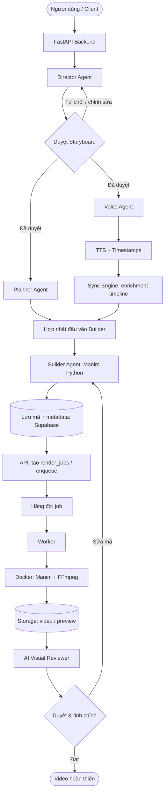

# Kiến trúc Hệ thống & Hạ tầng Kỹ thuật (Direct Code Version)

Tài liệu này đặc tả luồng dữ liệu tinh gọn, **phân tách rõ** giữa dịch vụ API (điều phối, AI, metadata) và **worker render** (Manim chỉ chạy tại đây, bên trong Docker).

---

## 1. Kiến trúc Tổng thể (High-Level Architecture)

### 1.1 Nguyên tắc phân tách

- **Backend (FastAPI):** REST/Webhook, xác thực, đọc/ghi Supabase, gọi `ai_engine`, **không** gọi trực tiếp binary Manim trên cùng process máy chủ API.
- **Worker:** Nhận job từ hàng đợi (hoặc poll `render_jobs`), tải mã scene + asset, **khởi chạy container Docker** đã cài Manim/FFmpeg, render, upload artefact, cập nhật trạng thái job.
- **AI Engine:** Chạy cùng backend hoặc service riêng tuỳ triển khai; sinh kịch bản, kế hoạch đồ họa, mã Python; **không** yêu cầu Manim runtime để phục vụ request đồng bộ thông thường.

### 1.2 Luồng nghiệp vụ (đã chỉnh: điểm hợp nhất trước Builder)

Sau khi người dùng duyệt storyboard, **Planner** và **Voice** có thể chạy song song (CPU/IO khác nhau). **Builder chỉ bắt đầu khi đã có đủ hai đầu vào:** (1) kế hoạch đồ họa / primitive plan từ Planner, (2) audio + word-level timestamps (và nếu có thêm **Sync Engine**: bản enriched timeline / segments). Như vậy tránh race condition và tránh sinh mã rồi phải vá lại theo audio chưa cố định.

**Ghi chú:** Visual QA có thể chạy trên worker sau khi có file video, hoặc qua service phân tích ảnh trích frame; không cần Manim để phân tích QA.

---

## 2. Technical Stack

### 2.1 Cơ sở dữ liệu & Xác thực (Supabase)

- **Database:** PostgreSQL — metadata dự án, scene, job, asset.
- **Auth:** JWT / Bearer cho API.
- **Storage:** audio, video, frame preview.
- **Webhooks (phase sau):** thông báo job hoàn tất.

### 2.2 AI Engine

- **LiteLLM:** định tuyến model (Planner/Builder/Director/Vision QA).
- **TTS:** Piper only (Celery `tts` worker); tham số CLI trong `ai_engine/config/piper*.yaml`; alignment bổ sung bằng Whisper khi cần.

### 2.3 Đồ họa, media & worker

- **Manim Community Edition (ManimCE):** chỉ trong **image Docker** của worker. Đây là **mặc định của dự án** (cài đặt theo [Manim Community](https://www.manim.community/), thường qua PyPI `manim`). **Không** dùng nhánh Manim gốc (3Blue1Brown) làm runtime mặc định — API và phân phối khác ManimCE; chỉ nên cân nhắc nếu chủ động port toàn bộ `primitives` và cố định phiên bản riêng.
- **FFmpeg:** mux audio/video, post-process trong container (hoặc bước worker sau Manim).
- **Whisper / forced alignment:** tạo hoặc tinh chỉnh timestamp theo từ.

### 2.4 Cấu trúc sinh mã (function-based)

- Scene chia `step_n()`; Builder sinh mã gọi `primitives` đã đăng ký.

---

## 3. Backend so với Worker

| Thành phần   | Vai trò                                                                    |
| ------------ | -------------------------------------------------------------------------- |
| FastAPI      | Auth, CRUD project/scene, trigger agent, ghi DB, enqueue render            |
| AI agents    | Sinh storyboard, plan, voice script, code; Sync enrichment (logic)         |
| Worker       | Pull job, `docker run` (hoặc sibling container), manim CLI, upload kết quả |
| Docker image | Python + Manim + font + FFmpeg cố định phiên bản                           |

---

*Trở về tập chỉ mục:* [00_index.md](./00_index.md)