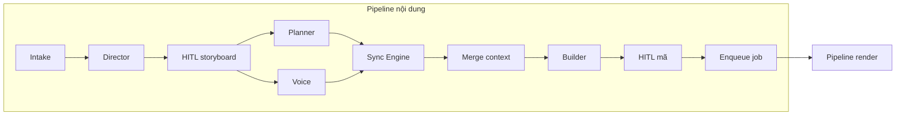

# Pipeline sản xuất video & đồng bộ âm–hình

Tài liệu này mô tả **hai lớp pipeline** chồng lên nhau:

1. **Pipeline nội dung (Content):** từ ý tưởng người dùng → storyboard → thoại/timeline → mã scene → duyệt.
2. **Pipeline render (Execution):** từ job đã enqueue → worker → Docker (Manim) → mux media → upload → QA.

**Đồng bộ âm–hình (sync)** là một **giai đoạn** trong pipeline nội dung (giữa audio/timestamp và mã Manim), không thay thế toàn bộ khái niệm “pipeline”.

---

## 1. Pipeline nội dung (Content pipeline)

Luồng tuầ tự nghiệp vụ; song song chỉ nơi đã ghi rõ.

| Bước | Tên                         | Đầu vào                            | Đầu ra / Artefact                                             |
| ---- | --------------------------- | ---------------------------------- | ------------------------------------------------------------- |
| C1   | **Intake**                  | Prompt / brief người dùng          | Bản ghi `project`, trạng thái `draft`                         |
| C2   | **Director**                | Brief                              | Storyboard + thoại thô (DB / editor)                          |
| C3   | **HITL — storyboard**       | Storyboard                         | Quyết định duyệt / chỉnh; khóa nội dung sáng tạo              |
| C4a  | **Planner** (song song C4b) | Storyboard đã duyệt                | `planner_output` (JSON: primitives, beats hình)               |
| C4b  | **Voice**                   | Thoại đã khóa                      | Audio URL + `timestamps` (raw)                                |
| C5   | **Sync Engine**             | Raw timestamps + thoại             | `sync_segments` (timeline chuẩn cho Builder)                  |
| C6   | **Merge đầu vào Builder**   | `planner_output` + `sync_segments` | Một “build context” phiên bản hóa (cho idempotent)            |
| C7   | **Builder**                 | Build context                      | `manim_code` (+ bump `manim_code_version` nếu đổi audio/plan) |
| C8   | **HITL — mã (tuỳ chọn)**    | Mã scene                           | Duyệt hoặc sửa tay trước render                               |
| C9   | **Enqueue render**          | Scene / project                    | Bản ghi `render_jobs`, trạng thái `queued`                    |

Sau C9, điều khiển chuyển sang **pipeline render** (mục 2).

---

## 2. Pipeline render (Worker / Execution)

API **không** chạy Manim. Worker kéo job, chuẩn bị workspace, gọi **Docker image** có Manim + FFmpeg.

| Bước | Tên                       | Mô tả                                                                                    |
| ---- | ------------------------- | ---------------------------------------------------------------------------------------- |
| R1   | **Claim job**             | Worker đánh dấu `rendering`, ghi `started_at`                                            |
| R2   | **Materialize workspace** | Tải `manim_code`, asset, audio từ Storage/DB vào volume job                              |
| R3   | **Run container**         | `manim` CLI (hoặc entrypoint) — độ phân giải theo `job_type` preview/full                |
| R4   | **Capture logs**          | Stream log vào `render_jobs.logs`; tiến độ ước lượng → `progress`                        |
| R5   | **Post-render**           | (Tuỳ chọn) trích frame preview, đo thời lượng file, so timeline → góp phần `sync_report` |
| R6   | **Mux / finalize**        | FFmpeg: ghép video thô + audio + phụ đề nếu có                                           |
| R7   | **Upload & persist**      | Ghi `asset_url`, cập nhật `completed` / `failed`, `completed_at`                         |
| R8   | **Webhook (phase sau)**   | POST tới `webhook_url` nếu có                                                            |

Trạng thái job điển hình: `queued` → `rendering` → `completed` | `failed` | `cancelled`.

---

## 3. Pipeline QA & bàn giao

| Bước | Tên                | Mô tả                                                                            |
| ---- | ------------------ | -------------------------------------------------------------------------------- |
| Q1   | **Visual QA (AI)** | Vision model trên frame/video: overlap, chữ tràn, v.v.                           |
| Q2   | **HITL cuối**      | Người chấp nhận hoặc yêu cầu revision (thường quay lại C7 hoặc C4 nếu đổi thoại) |
| Q3   | **Publish**        | Đánh dấu `project.status`, link video cuối cho client                            |

---

## 4. Sync Engine (chi tiết trong pipeline nội dung)

Đây là giai đoạn **C5** ở bảng trên — biến timestamp thoại thành **ngân sách thời gian** cho từng `step_n` của scene.

### 4.1 Trích xuất timestamp

Word-level từ TTS (nếu có) hoặc forced alignment (Whisper / MFA / …) trên waveform đã render.

### 4.2 Enrichment (segment)

Gắn thoại vào khoảng thời gian, ví dụ: `00:01.200 - 00:02.500: "Giả sử chúng ta có một mảng"`.

### 4.3 Ánh xạ sang scene

Map segment → `step_k()`; mỗi bước có **ngân sách** = độ dài segment trừ tổng `run_time` animation đã chọn (xem mục 5).

---

## 5. Xử lý overlap animation vs thoại

- Animation **dài hơn** segment thoại: co `run_time`, thêm silence cuối audio (version mới), hoặc tách beat hình (có thể cần HITL).
- Animation **ngắn hơn**: `self.wait` cuối bước để lấp segment.

---

## 6. Cấu trúc scene (function-based)

`construct()` chỉ điều phối; từng `step_n` khớp một nhóm segment trong `sync_segments`. Chi tiết quy ước code: xem [08_project_structure.md](./08_project_structure.md).

---

## 7. Artefact đầu ra (theo pipeline)

| Artefact                           | Thuộc pipeline                | Ghi chú                               |
| ---------------------------------- | ----------------------------- | ------------------------------------- |
| `source_code.py` / DB `manim_code` | Nội dung (C7)                 | Version theo `manim_code_version`     |
| Video thô / từng scene             | Render (R3–R6)                | Trên Storage hoặc local worker        |
| `final_video.mp4`                  | Render + mux (R6–R7)          | Sản phẩm mux cuối                     |
| `sync_report.json`                 | Sync + đo sau render (C5, R5) | Map segment ↔ step; drift nếu đo được |

---

## 8. Phụ lục: vì sao sync khó & chiến lược thực dụng

Phần này **không** thay pipeline ở trên; nó giải thích rủi ro của **một giai đoạn (C5–C7)** để thiết kế sản phẩm không ảo tưởng “một phát khớp hoàn toàn”.

- **Jitter TTS:** mỗi lần render audio lại có thể đổi độ dài → luôn khóa version audio + timestamp với `manim_code_version`.
- **Khớp từ vs khớp đoạn:** ưu tiên MVP theo **câu / đoạn** (ít brittle hơn word-level cho đồ họa nặng).
- **Đo sau render:** so timeline kỳ vọng với thời lượng thực (log/hook) → ghi vào `sync_report`, gợi ý chỉnh có ngưỡng, tránh vòng lặp tự động vô hạn.
- **Hai lớp thời gian:** (A) timeline thoại khóa; (B) timeline hình linh hoạt — khi xung đột, ưu tiên **đúng nghĩa** (HITL) hơn đúng từng milisecond.

Nâng cao sau: phụ đề theo từ; time-stretch audio có giới hạn chất lượng.

---

*Trở về tập chỉ mục:* [00_index.md](./00_index.md)