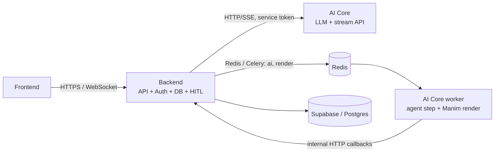
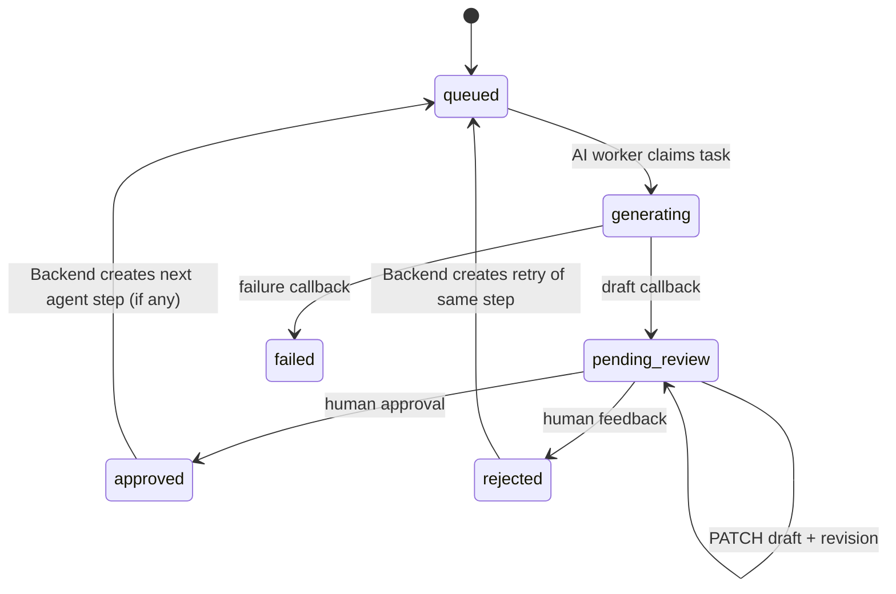

# Architecture

## Ownership

| Area | Owner | Forbidden dependency |
| --- | --- | --- |
| Identity, authorization, projects, scenes, HITL revisions, database and task dispatch | `backend/` | `ai_core/`, Manim, LLM SDKs |
| Google model calls, code generation, token streaming, AST validation and Manim rendering | `ai_core/` | `backend/` source, Supabase/Postgres credentials |
| Request/response models only | `shared/` | persistence, queues, LLMs, rendering |

AI Core receives a work item only after it claims an ID from Backend. It returns output only to Backend's internal callback endpoint. This keeps the database private while allowing both services to deploy and scale independently.

## HITL state machine

Every agent step is durable and editable. The AI pipeline follows a "1 Master - N Minions" model:
- **Project-Level (Master)**: `storyboarder` generates the overall script and populates scenes.
- **Scene-Level (Minions)**: `builder` translates visual actions directly into Manim code.
- **Fallback**: `code_reviewer` and `visual_reviewer` run automatically only if the builder fails (e.g. compile error).

Approval and edits require `expected_revision`. A stale browser tab receives `409 Conflict` rather than overwriting newer human edits. A Celery task ends when it submits a draft; it never holds a worker slot while waiting for a person.

## Fast and heavy paths

- Chat uses Backend-to-AI-Core HTTP. Token streaming is AI Core SSE relayed through Backend's authenticated WebSocket endpoint.
- Agent execution and rendering use Redis queues `ai` and `render`. Worker callbacks update Backend, which publishes project events to its WebSocket gateway.
- The API container has no Manim, rendering or provider dependency. The worker has no database credential.

## Operational rules

1. Set the same non-default `INTERNAL_SERVICE_TOKEN` in both service environments.
2. Keep `SUPABASE_SERVICE_ROLE_KEY` only in `backend/.backend.env`.
3. Keep `GOOGLE_API_KEY` only in `ai_core/.ai_core.env`. The pool uses `AVAILABLE`, `COOLDOWN` (60 seconds) and `EXHAUSTED` (until UTC midnight) states.
4. Apply all existing Supabase migrations, then `20260712000000_hitl_steps.sql`.
5. Local Compose shares the read-only `render_artifacts` volume with Backend, which authorizes `GET /v1/jobs/{jobId}/video`. In production set `ARTIFACT_PUBLIC_BASE_URL` only when an external artifact service publishes the same object path; otherwise use a dedicated signed-upload integration.
