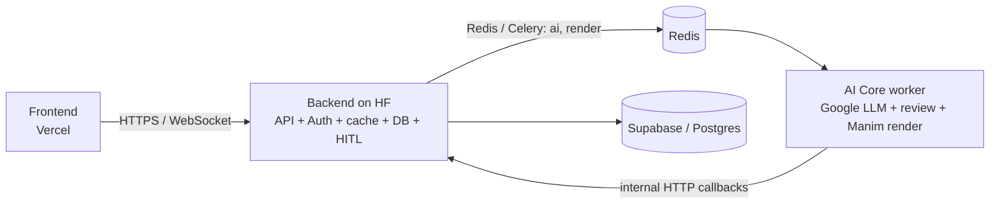
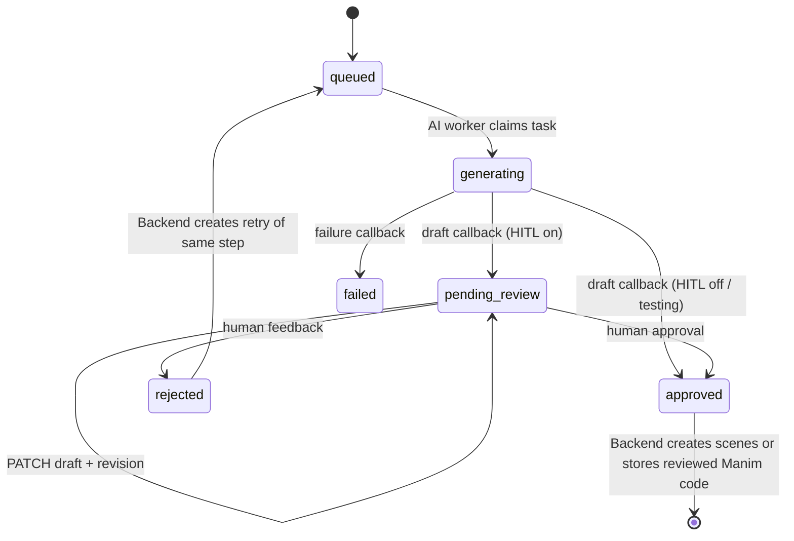

# Architecture

## Ownership

| Area | Owner | Forbidden dependency |
| --- | --- | --- |
| Identity, authorization, projects, scenes, HITL revisions, database and task dispatch | `backend/` | `ai_core/`, Manim, LLM SDKs |
| Google model calls, code generation, token streaming, AST validation and Manim rendering | `ai_core/` | `backend/` source, Supabase/Postgres credentials |
| Request/response models only | `shared/` | persistence, queues, LLMs, rendering |

AI Core receives a work item only after it claims an ID from Backend. It returns output only to Backend's internal callback endpoint. This keeps the database private while allowing both services to deploy and scale independently.

## HITL state machine

The locked generation pipeline has three durable, user-visible stages:
1. **Idea Sketch (project level)**: `idea_sketcher` creates a concise concept blueprint and auto-advances without adding a HITL pause.
2. **Storyboard (project level)**: `storyboarder` consumes the approved blueprint and creates a reviewable scene plan.
3. **Builder (scene level)**: `builder` generates source, then runs private code and visual auto-review before returning one reviewable Manim artifact. Builder tasks are dispatched **in parallel** for all scenes immediately upon storyboard approval.

Reviewers never rewrite the source wholesale: every proposed fix is an exact `original_code` → `replacement_code` replacement, applied once. Their ordered fallback is `gemma-4-31b-it` → `gemini-3-flash-preview` → `gemini-3.5-flash`; the final tier may make several distinct attempts.

### Runtime-grounded repair

Before the Code Reviewer proposes a patch, AI Core parses the plain or Rich Manim traceback and resolves the implicated symbol from the failing source line. It imports the Manim package used by that worker process and uses `inspect` to collect the symbol's live signature, short documentation, and a bounded usage example. A version-scoped compatibility map is consulted only when that symbol is absent, and an alternative is emitted only after it is also resolved in the running runtime.

Each unresolved error has an in-memory repair ledger containing the model, error fingerprint, exact attempted replacement, explanation, outcome, and a semantic strategy fingerprint. Every later model receives that ledger. A deterministic guard rejects formatting-equivalent repeated strategies. Once execution advances to a different error, the active ledger is reset while the complete iteration audit remains in the final step output.

Every generation stage is durable; Storyboard/Builder outputs are editable at their HITL gates. Code/visual review is
an internal Builder loop whose audit is stored inside the Builder output.

Approval and edits require `expected_revision`. A stale browser tab receives `409 Conflict` rather than overwriting newer human edits. A Celery task ends when it submits a draft; it never holds a worker slot while waiting for a person.

Rolling back an approved Master cancels unfinished child runs and removes its
derived scene topology before reopening the storyboard draft. Rolling back a
Builder clears the scene's approved code/video and the project video before
reopening that Builder draft. Backend serializes mutations with a bounded Redis
lock per project/scene target, cancels the prior active run before creating its
replacement, and rejects late claims, callbacks, edits, approvals, and rollbacks
that no longer own the target.

## Fast and heavy paths

- User-visible HITL and render state is emitted by Backend over the project WebSocket; AI Core exposes no orphan public generation endpoint.
- Agent execution and rendering use Redis queues `ai` and `render`. Worker callbacks update Backend, which publishes project events to its WebSocket gateway.
- The API container has no Manim, rendering or provider dependency. The worker has no database credential.

## Cache and real-time consistency

- Supabase is the production source of truth. Backend uses fail-open Redis JSON read-through caches for projects, scenes, settings, runs, steps, list pages, and dashboard aggregates.
- Object writes refresh their object key and bump generation counters for affected lists and aggregates. Redis render jobs and their per-project indexes are already the authoritative job cache.
- Every render job captures a hash of its exact approved source: scene code version/hash for a scene, or the ordered scene-video snapshot for a full project. Claim and completion both revalidate that hash, and compare-and-set persistence rejects a late artifact after regeneration, rollback, or a newer scene render.
- Pub/Sub events are hints, not transactions. Every event has an ID, timestamp, project ID, and a stable top-level `scene_id` where applicable. The Backend Redis listener and browser socket both reconnect; the browser refetches authoritative REST state and active render jobs after reconnect.
- The Scene Editor keeps a separate workspace per scene, so local drafts, revisions, reviewer history, generation state, render progress, and preview URLs cannot bleed across tabs. REST responses carry an observed event-version fence in the client: fields changed by a newer WebSocket event are preserved instead of being overwritten by an older in-flight response. A dirty draft is bound to its exact run/step; if that owner changes, the text is retained as an explicit conflict copy rather than attached to the new step.

## Operational rules

1. Set the same non-default `INTERNAL_SERVICE_TOKEN` in both service environments.
2. Keep `SUPABASE_SECRET_KEY` (or the legacy service-role alias) only in Backend.
3. Keep `GOOGLE_API_KEY` only in `ai_core/.env`. The Redis-backed key pool coordinates `AVAILABLE`, `COOLDOWN`, and `EXHAUSTED` states across parallel Celery processes.
4. Treat `backend/supabase/migrations/*.sql` as the only deployable schema and apply them through Supabase CLI/CI; never deploy `init_schema.sql`.
5. Set `AUTH_MODE=jwt`, `SUPABASE_URL`, and the Backend secret key outside development. Prefer asymmetric JWT signing and JWKS; configure `SUPABASE_JWT_SECRET` only for legacy HS256. Frontend sends access tokens in HTTP Authorization and the WebSocket subprotocol header, never in a URL.
6. Local Compose shares the read-only `render_artifacts` volume with Backend. When Supabase Storage is configured, Backend uploads the completed worker artifact and signs the durable project/scene reference; after that callback confirms a `supabase://` object, the render worker removes its local staging file. Without Storage, it retains and authorizes the local project/scene video stream. Reload of production video does not depend on Redis job retention.
7. The worker runs as an unprivileged user with dropped Linux capabilities, cgroup limits and Manim process memory/CPU/file-descriptor limits. Generated Manim subprocesses receive a minimal environment with provider, Backend and database secrets removed.
8. The Hugging Face profile co-locates Backend, Redis and both workers to satisfy its port/network and artifact-transfer constraints; the frontend is isolated on Vercel. The Space is protected, single-tenant and trusted-input only. A hostile multi-tenant renderer requires an ephemeral sandbox with no runtime secrets.
