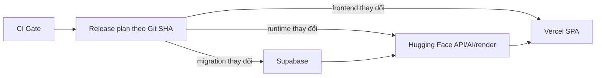

# CI/CD và triển khai production

Production có ba target độc lập:



Nếu cùng một commit thay đổi nhiều target, thứ tự promotion là Supabase →
Hugging Face → Vercel. Nếu chỉ một target thay đổi, các job còn lại được skip và
không nhận secret production.

## Phạm vi thay đổi

`scripts/ci/release_plan.py` là classifier duy nhất dùng cho CI và CD.

| Target | File kích hoạt production deploy |
| --- | --- |
| Supabase | `backend/supabase/migrations/**`, `config.toml`, `postmigration_gate.sql` |
| Hugging Face | root `Dockerfile`, `.dockerignore`, `backend/app/**`, production lock Backend, `ai_core/app/**`, `ai_core/config/**`, production lock AI, `shared/**`, `deploy/huggingface/**` |
| Vercel | frontend source/public/build config/package lock và `frontend/vercel.json` |

Docs, test, Makefile, Compose, `.env.example`, dev lock và Supabase validator
không redeploy runtime. Test nằm cạnh frontend source (`*.test.ts[x]`) vẫn chạy
frontend CI nhưng không redeploy Vercel.

Workflow không đặt `paths` ở cấp trigger vì required workflow bị skip có thể
treo ở trạng thái Pending. Job `Release scope` luôn chạy, còn Backend, AI,
Frontend, migration replay, dependency audit và production image dùng output
boolean rõ ràng. `CI Gate` luôn tồn tại và là required check ổn định cần cấu hình
trong branch protection.

## Chống mất deploy và rollback do CI lệch thứ tự

CI tính diff chính xác từ `github.event.before` đến `github.sha`, nên push nhiều
commit và rename/delete đều được bao phủ. Trên `main`, CI còn so với deployment
baseline của từng target và chạy **CI tích lũy** cho mọi artifact chưa deploy.
Vì vậy, nếu CI của commit A lỗi/bị cancel rồi commit B chỉ sửa docs, B vẫn phải
chạy lại test Backend/AI/image, Frontend hoặc migration tương ứng trước khi được
phép mang thay đổi A lên production. Khi baseline thiếu/diverge, toàn bộ check
của target đó được bật fail-safe.

CI upload artifact JSON chứa SHA, danh sách file, boolean scope và
`ci_target_coverage`. `CI Gate` đối chiếu mọi scope được chọn với job thực sự
`success`; CD tái tính coverage từ artifact và từ chối deploy target chưa được
CI của đúng SHA bao phủ. `Deploy production` được kích hoạt qua `workflow_run`,
tải artifact từ đúng run ID, kiểm tra SHA/schema/type và không thực thi nội dung
artifact.

Mỗi target thành công được ghi vào GitHub Deployments với task riêng:

- `deploy:supabase`
- `deploy:huggingface`
- `deploy:vercel`

Trước mỗi release, planner so tested SHA với deployment thành công gần nhất của
từng task rồi phân loại toàn bộ diff tích lũy. Cách này xử lý hai race quan trọng:

- commit A đổi frontend, commit B chỉ đổi docs: B vẫn mang thay đổi frontend chưa
  deploy từ A;
- CI của commit cũ hoàn tất sau commit mới: nếu commit mới đã deploy, commit cũ
  bị skip thay vì rollback production.

Không có baseline, baseline mất khỏi Git history hoặc history phân nhánh đều
fail-safe thành redeploy target tương ứng. Revision không còn là ancestor của
`main` bị từ chối hoàn toàn.

## Ranh giới privilege

Pull request và CI không nhận secret production. Workflow deploy giữ các gate:

- CI conclusion là `success`;
- event gốc là `push` lên `main`;
- source repository trùng repository hiện tại;
- checkout đúng `workflow_run.head_sha` với credential persistence tắt;
- artifact thuộc đúng triggering run;
- GitHub Environment `production` phê duyệt từng job mutation.

Job planner chỉ có `actions: read`, `contents: read`, `deployments: read`. Job
mutation chỉ có `contents: read`, `deployments: write`. Cảnh báo heuristic
`workflow_run` từ scanner không được xử lý bằng cách bỏ các gate trên.

## Hugging Face: chỉ mirror payload runtime

`deploy/huggingface/prepare-payload.sh <tested-sha> <new-dir>` dùng `git archive`
trên đúng SHA đã qua CI và tạo allowlist:

```text
.dockerignore
Dockerfile
README.md                         # từ deploy/huggingface/README.md
SOURCE_REVISION
PAYLOAD_MANIFEST.sha256
backend/requirements.lock
backend/app/**
ai_core/requirements.lock
ai_core/app/**
ai_core/config/**
shared/**
deploy/huggingface/{entrypoint.sh,healthcheck.sh,service-entrypoint.sh,redis.conf,supervisord.conf}
```

Script fail nếu có frontend, migration, tests, docs, `.env`, private key,
symlink, bytecode hoặc thiếu executable/metadata bắt buộc. CI build, scan và
smoke-test image từ chính thư mục staging này. CD sau đó đưa duy nhất staging
directory cho `huggingface/hub-sync` được pin; action mirror với delete nên lần
đầu sẽ xóa file monorepo thừa khỏi HEAD của Space. Variables, Secrets, persistent
Storage và Git history không bị xóa. Space phải là target chuyên dụng; file sửa
tay trên Space sẽ bị mirror xóa.

Sau upload, CD so file tree remote với allowlist cộng `.gitattributes`, đợi đúng
HF revision đạt `RUNNING`, rồi bắt buộc `/ready` trả `status=ready`. Readiness
kiểm tra Redis, Supabase/HITL và xác nhận consumer Celery đang phục vụ đủ hai
queue `ai`, `render`; Docker healthcheck cũng yêu cầu cả bốn process Supervisor
ở trạng thái `RUNNING`.

Space phải dùng SDK Docker, visibility **Protected**, always-on hardware và
persistent storage `/data`. Private Space không phù hợp vì browser Vercel không
được nhận `HF_TOKEN`.

## Vercel: build prebuilt, không upload monorepo

Tạo Vercel project với Root Directory `frontend`, sau đó tắt Git auto-deploy để
tránh một commit được triển khai hai lần. GitHub Actions dùng Vercel CLI được pin:

1. `vercel pull --environment=production`;
2. `vercel build --prod`;
3. parse file env do Vercel pull về mà không log giá trị; xác nhận đủ năm biến,
   API/WS cùng trỏ đúng `HF_SPACE_ORIGIN`, auth là `jwt`, Supabase URL đúng
   project và key bắt đầu bằng `sb_publishable_`;
4. `vercel deploy --prebuilt --prod --archive=tgz`.

Vercel chỉ nhận `.vercel/output`, không nhận Backend, AI, migration, docs hoặc
toàn monorepo. `frontend/vercel.json` khai báo Vite output và SPA deep-link
rewrite về `index.html`. Trước upload, workflow thêm marker SHA vào prebuilt
output; sau deploy nó yêu cầu cả immutable deployment URL và canonical origin
phục vụ đúng SHA đã qua CI trước khi ghi baseline thành công.

Các Production Environment Variables bắt buộc trên Vercel:

| Tên | Giá trị |
| --- | --- |
| `VITE_AUTH_MODE` | `jwt` |
| `VITE_API_BASE_URL` | `https://<space>.hf.space/v1` |
| `VITE_WS_BASE_URL` | `https://<space>.hf.space/v1` |
| `VITE_SUPABASE_URL` | Supabase Project URL |
| `VITE_SUPABASE_PUBLISHABLE_KEY` | Public publishable key, không phải secret/service-role key |

## GitHub Environment `production`

Khuyến nghị bật required reviewers và deployment branch chỉ cho `main`.

Variables:

| Tên | Ý nghĩa |
| --- | --- |
| `HF_SPACE_ID` | `namespace/space-name` của protected Docker Space |
| `HF_SPACE_ORIGIN` | Canonical origin do Space API trả về, ví dụ `https://namespace-space.hf.space` |
| `SUPABASE_PROJECT_REF` | Project ref production |
| `VERCEL_PRODUCTION_ORIGIN` | Origin production/canonical của SPA, ví dụ `https://app.example.com` |

Secrets:

| Tên | Phạm vi tối thiểu |
| --- | --- |
| `HF_TOKEN` | Fine-grained write chỉ trên Space đích |
| `SUPABASE_ACCESS_TOKEN` | Migration write và database read cho đúng project |
| `SUPABASE_DB_PASSWORD` | Password database production |
| `VERCEL_TOKEN` | Deploy đúng Vercel project/team |
| `VERCEL_ORG_ID` | Team/user ID dùng bởi Vercel CLI |
| `VERCEL_PROJECT_ID` | Project ID của frontend |

Google key, Supabase secret key và internal token chỉ nằm trong Space Settings;
không đặt chúng vào GitHub deployment secrets hoặc Vercel.

## Space Variables/Secrets

Space Variables bắt buộc: `APP_ENV=production`, `AUTH_MODE=jwt`,
`SUPABASE_URL`, và `CORS_ORIGINS` chứa chính xác
`VERCEL_PRODUCTION_ORIGIN` (không `*`). Redis/Celery dùng loopback
`redis://127.0.0.1:6379/0`.

Space Secrets bắt buộc: `INTERNAL_SERVICE_TOKEN`, `SUPABASE_SECRET_KEY` (hoặc
legacy service-role alias), và ít nhất một Google/Gemini provider key. Frontend
VITE variables không còn thuộc Space.

## Migration và rollback

Supabase job chỉ chạy khi production schema inputs thay đổi. Nó thực hiện dry
run, `db push --include-all`, rồi yêu cầu cả tám counter từ
`postmigration_gate.sql` bằng 0 trước khi target sau được promote. Migration là
forward-only; không sửa version đã apply và không dùng `db reset --linked`.

Ứng dụng rollback bằng một commit tương thích schema đã qua CI. Cơ chế baseline
không cho một CI run cũ tự rollback target mới hơn; rollback chủ đích phải là
commit mới/revert trên `main` để có lịch sử và CI mới.

## Kiểm tra local

```bash
python3 -m unittest scripts/ci/test_release_plan.py
bash -n deploy/huggingface/prepare-payload.sh
bash backend/supabase/validate_migrations.sh
docker run --rm -v "$PWD:/repo" -w /repo rhysd/actionlint:1.7.7
```

Tài liệu nền tảng:

- [GitHub workflow path filters](https://docs.github.com/en/actions/how-tos/write-workflows/choose-when-workflows-run/trigger-a-workflow)
- [GitHub Deployments API](https://docs.github.com/en/rest/deployments/deployments)
- [Vercel GitHub Actions](https://vercel.com/kb/guide/how-can-i-use-github-actions-with-vercel)
- [Vercel prebuilt deployment](https://vercel.com/docs/cli/deploying-from-cli)
- [Vite SPA trên Vercel](https://vercel.com/docs/frameworks/frontend/vite)
- [Hugging Face hub-sync](https://github.com/huggingface/hub-sync)
- [Supabase migrations](https://supabase.com/docs/guides/deployment/database-migrations)
