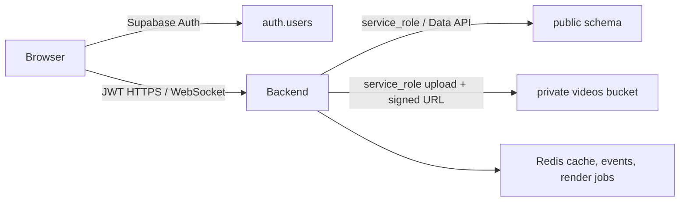
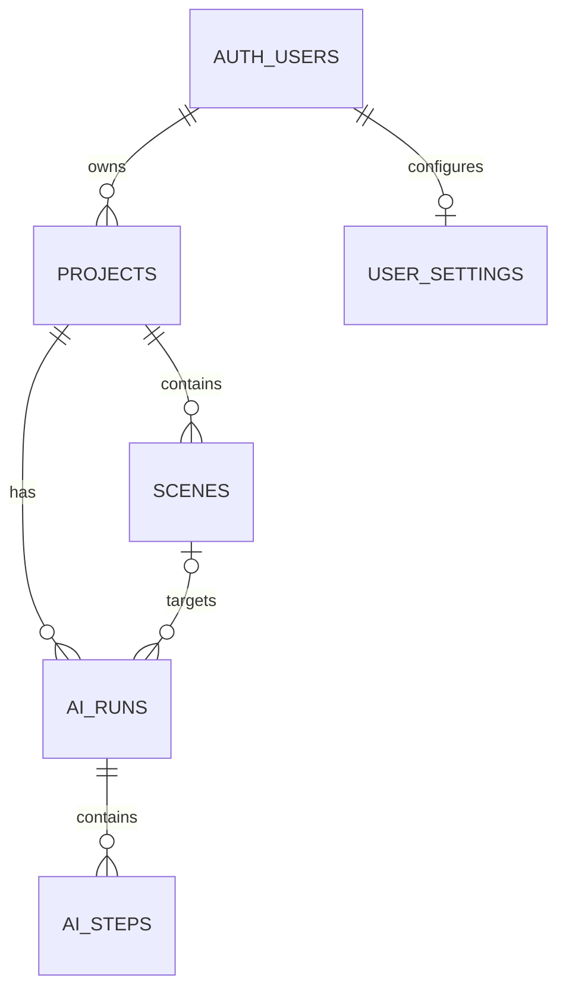

# Database and Storage

Supabase Postgres is the durable source of truth for projects, scenes, user
settings and the human-review pipeline. Redis is a cache, event bus and the
authoritative store for ephemeral render jobs; it is not a database fallback in
production.

## Topology



AI Core and rendering workers never receive Supabase credentials. They exchange
work and artifacts through Redis and authenticated Backend callbacks.

## Active schema

| Table | Purpose | Ownership/integrity |
| --- | --- | --- |
| `projects` | User projects and final project video reference | `user_id → auth.users`; deletion cascades |
| `scenes` | Ordered storyboard/code/render state | belongs to one project; `(project_id, scene_order)` is unique and positive |
| `user_settings` | Complete validated generation/render/TTS preferences | one row per Auth user |
| `ai_runs` | Durable project-level or scene-level HITL run | user must own project; optional scene must belong to that project |
| `ai_steps` | Ordered, revisioned work within a run | project and optional scene must match the parent run; `(run_id, sequence)` is unique on clean deployments |



The database retains nine historical tables for migration compatibility:
`render_jobs`, `voice_jobs`, `assets`, `pipeline_runs`, `scene_code_history`,
`agent_logs`, `worker_service_audit`, `pipeline_events`, and
`artifact_versions`. Current application code does not persist to them. They
have RLS enabled but no Data API privileges or policies. Remove them only in a
separate migration after confirming that the linked production project has no
data-retention requirement.

`render_jobs` remains structurally compatible with the shared contract while it
is retained: it accepts `preview`, `full`, and `full_project` and stores a JSONB
`metadata` document. Live render-job state remains in Redis.

## Authorization boundary

The production contract is Backend-only table access:

- `anon`: no application-table privileges.
- `authenticated`: no application-table privileges.
- `service_role`: CRUD on the five active tables only.

RLS policies on active tables explicitly target `authenticated`, cache
`auth.uid()` through `SELECT`, and verify parent ownership. They are defense in
depth for a future deliberate direct-client grant. A grant and its RLS tests
must be added in the same migration; never expose a table by changing Dashboard
defaults alone.

The service-role key bypasses RLS. Its secrecy and Backend ownership checks are
therefore part of the security boundary. It must never be present in browser,
AI Core or worker environments.

## Private video storage

Migration `20260721000000_production_hardening.sql` idempotently creates or
normalizes `storage.buckets.id = 'videos'` with:

- `public = false`;
- MIME allow-list `video/mp4`;
- per-object limit 1 GiB.

Backend is the only uploader and signer, so no `storage.objects` client policy
is defined. Hosted-project global Storage limits can be lower than the bucket
limit and must be sized for expected renders. Signed URLs are bearer URLs and
should have the shortest practical expiration.

Database cascade deletes do not remove Storage objects. Project deletion and
failed/replaced render cleanup require an operational lifecycle job.

## Migration lifecycle

`backend/supabase/migrations/*.sql` is the only deployable source of truth.
`backend/supabase/init_schema.sql` is intentionally non-executable. Apply
migrations with Supabase CLI so versions are recorded; never paste the files
into the production SQL Editor.

The `20260721000000_production_hardening.sql` file is a final delta and cannot
bootstrap an empty database by itself. The complete schema is the result of the
full timestamp-ordered chain, which CI replays from an empty PostgreSQL 17
database on every change.

Required pre-merge check:

```bash
bash backend/supabase/validate_migrations.sh
```

Required full integration check when Supabase CLI is available:

```bash
cd backend
supabase db reset
supabase db lint --level warning
supabase test db
```

Deployment sequence:

1. Confirm a recoverable backup/PITR point and compare migration history.
2. Run `supabase db push --dry-run` against staging.
3. Apply with one serialized `supabase db push` job.
4. Run `backend/supabase/postmigration_gate.sql` and require all eight counters
   to be zero.
5. Run Security/Performance Advisors and Backend readiness checks.
6. Promote Backend only after the database gate succeeds.

Already-applied production migrations are immutable. Roll back with a new,
reviewed forward migration. `db reset --linked` is destructive and is permitted
only for disposable development/staging projects.

## Legacy-data gate

Production hardening avoids destroying or guessing how to repair unknown rows.
New foreign keys are installed `NOT VALID`, which protects new writes
immediately. Each is validated during migration when legacy data is already
clean; otherwise the migration emits a warning and continues. The unique step
sequence constraint follows the same rule.

Before promotion, execute the canonical read-only gate:

```bash
psql "$DATABASE_URL" -X -v ON_ERROR_STOP=1 \
  -f backend/supabase/postmigration_gate.sql
```

All eight returned counters must be zero. Besides dirty rows, the gate detects a
missing or redefined required constraint, an incomplete `service_role` grant,
unexpected browser-role/table privileges, callable public functions, and a
nullable/misaligned `projects.source_language`. If any counter is non-zero,
create a reviewed repair migration and repeat the staging restore/deploy test.
Do not silently delete or reassign tenant data.
