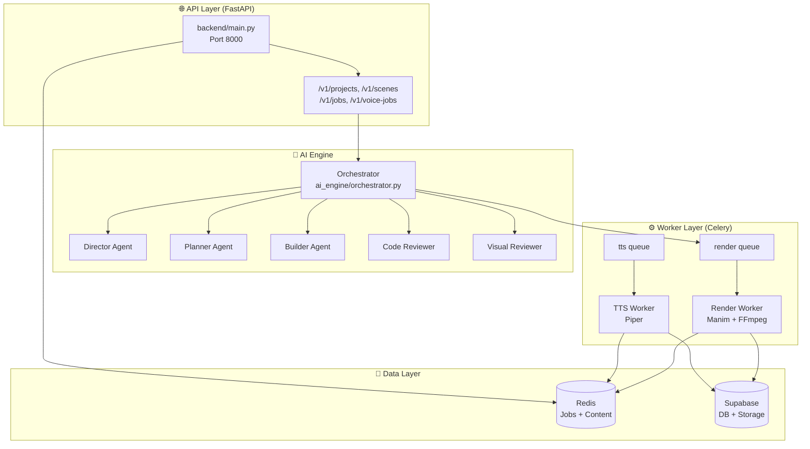
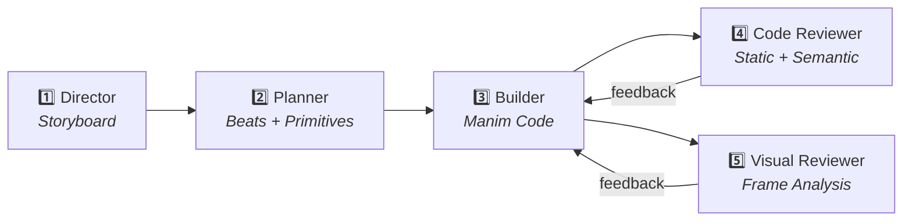
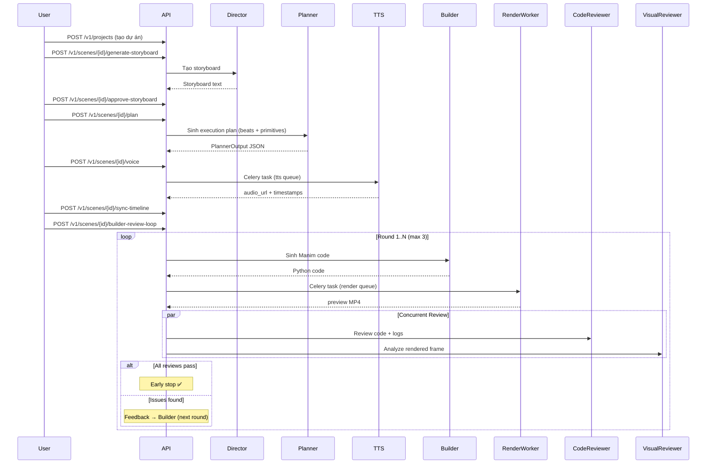
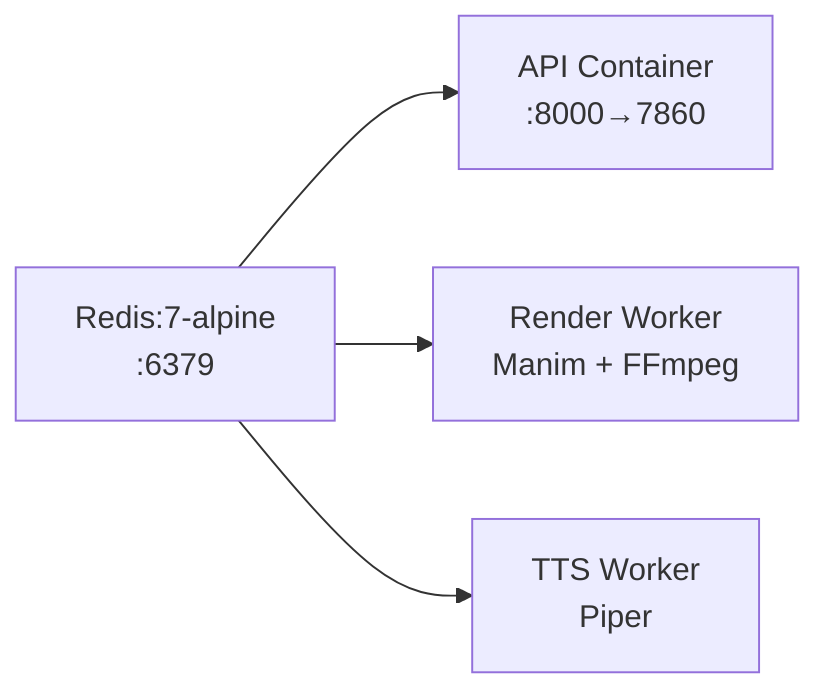

# 🎬 Manim Agent — Phân Tích Toàn Bộ Dự Án

## Tổng Quan

**Manim Agent** là một hệ thống sản xuất video Manim tự động bằng AI, sử dụng kiến trúc **multi-agent pipeline** kết hợp **microservices**. Hệ thống nhận đầu vào là ý tưởng/mô tả dự án, và tự động tạo ra video giáo dục hoàn chỉnh (có hình ảnh + lời thoại) mà không cần con người viết code.

| Chỉ số | Giá trị |
|--------|---------|
| **Ngôn ngữ** | Python 3.11+ |
| **Số file .py** | 171 |
| **Tổng dòng code** | ~14,300 |
| **Framework API** | FastAPI |
| **Task Queue** | Celery + Redis |
| **LLM Router** | LiteLLM (đa nhà cung cấp) |
| **TTS Engine** | Piper (+ macOS `say` fallback) |
| **Video Engine** | Manim + FFmpeg |
| **Persistence** | Redis (primary) + Supabase (optional) |
| **Deploy** | Docker Compose / Hugging Face Spaces |

---

## Kiến Trúc Hệ Thống



---

## Kiến Trúc Chi Tiết Theo Module

### 1. `backend/` — API Layer

| File | Vai trò |
|------|---------|
| [main.py](file:///Volumes/WorkSpace/Project/Manim_Agent/backend/main.py) | FastAPI app + health/readiness probes + Scalar UI |
| [core/config.py](file:///Volumes/WorkSpace/Project/Manim_Agent/backend/core/config.py) | Centralized `Settings` class (Pydantic BaseSettings, ~45 fields) |
| [core/correlation.py](file:///Volumes/WorkSpace/Project/Manim_Agent/backend/core/correlation.py) | Middleware inject `X-Correlation-ID` |
| [core/supabase_jwt.py](file:///Volumes/WorkSpace/Project/Manim_Agent/backend/core/supabase_jwt.py) | JWT authentication (`AUTH_MODE=jwt`) |
| [core/websocket_manager.py](file:///Volumes/WorkSpace/Project/Manim_Agent/backend/core/websocket_manager.py) | WebSocket broadcast cho real-time updates |
| [api/v1/scenes.py](file:///Volumes/WorkSpace/Project/Manim_Agent/backend/api/v1/scenes.py) | **Core API** — 10+ endpoints cho toàn bộ pipeline |
| [api/v1/projects.py](file:///Volumes/WorkSpace/Project/Manim_Agent/backend/api/v1/projects.py) | CRUD projects |
| [api/v1/render.py](file:///Volumes/WorkSpace/Project/Manim_Agent/backend/api/v1/render.py) | Render job enqueue + status |
| [db/content_store.py](file:///Volumes/WorkSpace/Project/Manim_Agent/backend/db/content_store.py) | Redis-backed persistence (Project, Scene) |
| [db/supabase_store.py](file:///Volumes/WorkSpace/Project/Manim_Agent/backend/db/supabase_store.py) | Supabase-backed alternative |
| [services/job_store.py](file:///Volumes/WorkSpace/Project/Manim_Agent/backend/services/job_store.py) | `RedisRenderJobStore` — job state machine |
| [services/voice_job_store.py](file:///Volumes/WorkSpace/Project/Manim_Agent/backend/services/voice_job_store.py) | `RedisVoiceJobStore` — TTS job tracking |
| [services/frame_info.py](file:///Volumes/WorkSpace/Project/Manim_Agent/backend/services/frame_info.py) | Extract preview frame (ffmpeg) for Visual Reviewer |
| [services/sync_engine_logic.py](file:///Volumes/WorkSpace/Project/Manim_Agent/backend/services/sync_engine_logic.py) | Audio-video sync validation |

> [!IMPORTANT]
> API **không** chạy Manim trực tiếp — mọi render đều ủy quyền cho worker qua Celery.

---

### 2. `ai_engine/` — Multi-Agent System

Đây là **trái tim** của hệ thống, bao gồm 5 AI agent chuyên biệt:



#### Agent Details

| Agent | File | Prompt | Model Config | Nhiệm vụ |
|-------|------|--------|------|-----------|
| **Director** | [director.py](file:///Volumes/WorkSpace/Project/Manim_Agent/ai_engine/agents/director.py) | [director_system.txt](file:///Volumes/WorkSpace/Project/Manim_Agent/ai_engine/prompts/director_system.txt) | temp=0.7, 8192 tokens | Sinh storyboard từ tiêu đề |
| **Planner** | [planner.py](file:///Volumes/WorkSpace/Project/Manim_Agent/ai_engine/agents/planner.py) | [planner_system.txt](file:///Volumes/WorkSpace/Project/Manim_Agent/ai_engine/prompts/planner_system.txt) | temp=0.4, 4096 tokens | Chia storyboard thành beats + primitives |
| **Builder** | [builder.py](file:///Volumes/WorkSpace/Project/Manim_Agent/ai_engine/agents/builder.py) | [builder_system.txt](file:///Volumes/WorkSpace/Project/Manim_Agent/ai_engine/prompts/builder_system.txt) | temp=0.2, 16384 tokens | Sinh Manim Python code |
| **Code Reviewer** | [code_reviewer.py](file:///Volumes/WorkSpace/Project/Manim_Agent/ai_engine/agents/code_reviewer.py) | [code_reviewer_system.txt](file:///Volumes/WorkSpace/Project/Manim_Agent/ai_engine/prompts/code_reviewer_system.txt) | temp=0.1, 8192 tokens | Review code + phát hiện lỗi |
| **Visual Reviewer** | [visual_reviewer.py](file:///Volumes/WorkSpace/Project/Manim_Agent/ai_engine/agents/visual_reviewer.py) | [visual_reviewer_system.txt](file:///Volumes/WorkSpace/Project/Manim_Agent/ai_engine/prompts/visual_reviewer_system.txt) | temp=0.1, 4096 tokens | Phân tích frame render |

#### Orchestrator ([orchestrator.py](file:///Volumes/WorkSpace/Project/Manim_Agent/ai_engine/orchestrator.py) — 803 dòng)

File lớn nhất, **điều phối toàn bộ pipeline**:

- `run_storyboard_phase()` → Director Agent
- `run_planning_phase()` → Planner Agent  
- `run_builder_loop_phase()` → **Builder-Reviewer Loop** (core loop)
  - Builder sinh code → Render preview → Code + Visual Review → Feedback → Lặp lại
  - **Early stop** khi cả code_review + visual_review pass
  - **Max rounds** (mặc định 3), có thể cấu hình
  - **Concurrent execution**: Code Reviewer và Visual Reviewer chạy song song (`ThreadPoolExecutor`)
  - **Sliding Window History**: Chỉ giữ 1 cặp assistant/user message gần nhất để tối ưu tokens

#### LLM Client ([llm_client.py](file:///Volumes/WorkSpace/Project/Manim_Agent/ai_engine/llm_client.py) — 554 dòng)

| Class | Mục đích |
|-------|----------|
| `LLMClient` (Protocol) | Interface chuẩn cho tất cả agents |
| `FakeLLMClient` | Deterministic mock cho CI/testing |
| `LiteLLMClient` | Production client — hỗ trợ OpenRouter, DashScope, Ollama |

**Multi-provider logic**: Tự động detect provider từ model name (`dashscope/`, `openrouter/`, etc.) và route API key + base URL phù hợp.

**Retry strategy**: `tenacity` — 3 retries cho text, 5 retries cho vision, exponential backoff.

#### Configuration ([config.py](file:///Volumes/WorkSpace/Project/Manim_Agent/ai_engine/config.py))

- **YAML-driven** agent model config ([agent_models.example.yaml](file:///Volumes/WorkSpace/Project/Manim_Agent/ai_engine/config/agent_models.example.yaml))
- `BuilderReviewLoopConfig` — điều khiển vòng lặp review
- `RuntimeLimitsConfig` — timeout cho worker, poll, LLM
- Hỗ trợ YAML anchors (`&stable`) để dùng chung model

#### RAG Module ([ai_engine/rag/](file:///Volumes/WorkSpace/Project/Manim_Agent/ai_engine/rag))

- `api_registry.py` — Registry API cho primitives catalog
- `log_parser.py` — Parse pipeline logs cho context
- `reviewer_context.py` — Build context cho reviewer agents

---

### 3. `worker/` — Task Workers

#### Render Worker

```
worker/tasks.py → worker/runtime.py → worker/renderer.py
```

| File | Vai trò |
|------|---------|
| [tasks.py](file:///Volumes/WorkSpace/Project/Manim_Agent/worker/tasks.py) | Celery task `render_manim_scene` (queue: `render`) |
| [runtime.py](file:///Volumes/WorkSpace/Project/Manim_Agent/worker/runtime.py) | Orchestrate: render → upload → audit → webhook → cleanup |
| [renderer.py](file:///Volumes/WorkSpace/Project/Manim_Agent/worker/renderer.py) | `manim render` subprocess + FFmpeg audio merge |

**Render flow**:
1. Đọc scene code từ Redis/Supabase
2. Inject `BEAT_DURATIONS` metadata (Dynamic Template)
3. Chạy `manim render` subprocess
4. Nếu scene có `audio_url`: download audio → FFmpeg merge
5. Upload lên Supabase Storage
6. Structured outputs: `storage/outputs/<project_id>/<scene_id>/`

#### TTS Worker

```
worker/tts_tasks.py → worker/tts_runtime.py
```

| File | Vai trò |
|------|---------|
| [tts_tasks.py](file:///Volumes/WorkSpace/Project/Manim_Agent/worker/tts_tasks.py) | Celery task `synthesize_voice` (queue: `tts`) |
| [tts_runtime.py](file:///Volumes/WorkSpace/Project/Manim_Agent/worker/tts_runtime.py) | Piper TTS + beat-based synthesis + timestamp alignment |

**TTS flow**:
1. Parse planner output → split thành beats
2. Mỗi beat → chạy Piper TTS riêng → WAV
3. Concat tất cả WAV → final audio
4. Calculate timestamps (SegmentSpan)
5. Upload → update Scene (audio_url, timestamps, sync_segments)
6. Fallback: macOS `say` / silent mock cho dev

#### Orchestrator Worker

| File | Vai trò |
|------|---------|
| [orchestrator_tasks.py](file:///Volumes/WorkSpace/Project/Manim_Agent/worker/orchestrator_tasks.py) | Background Celery task cho Builder-Review Loop |

#### Worker Health ([worker_health.py](file:///Volumes/WorkSpace/Project/Manim_Agent/worker/worker_health.py))

- FastAPI HTTP server trên `PORT`
- Spawn Celery worker qua `subprocess.Popen` trong `lifespan`
- Giải quyết yêu cầu Hugging Face Spaces phải có HTTP listener

---

### 4. `primitives/` — Manim Component Library

**46 primitives** được chia thành 5 danh mục:

| Category | Primitives | Ví dụ |
|----------|-----------|-------|
| **Visual** | 16 | `get_text_panel`, `get_code_box`, `get_array_block`, `get_data_chart`, `get_matrix_block` |
| **Animation** | 13 | `cinematic_fade_in`, `write_on`, `flash_attention`, `cascade_fade_in`, `typewriter_text` |
| **Layout** | 5 | `stack_horizontal`, `stack_vertical`, `center_mobject`, `surround_with_frame` |
| **Pedagogy** | 6 | `equation_morph`, `progressive_reveal`, `counter_animate`, `graph_trace` |
| **Domain** | 4 | `get_graph_network`, `get_binary_tree`, `get_timeline`, `get_flowchart` |

> [!TIP]
> Primitives catalog được serve qua `GET /v1/primitives/catalog` và inject vào Builder prompt để LLM biết sử dụng.

---

### 5. `shared/` — Cross-Module Contracts

| File | Vai trò |
|------|---------|
| [pipeline_log.py](file:///Volumes/WorkSpace/Project/Manim_Agent/shared/pipeline_log.py) | Structured JSON logging + Redis Pub/Sub broadcast |
| [code_utils.py](file:///Volumes/WorkSpace/Project/Manim_Agent/shared/code_utils.py) | Extract Python code từ LLM output |
| **schemas/** (16 files) | Pydantic models: `Scene`, `Project`, `RenderJob`, `VoiceJob`, `ReviewResult`, `PlannerOutput`, etc. |

---

## Pipeline End-to-End Flow



---

## Deployment Topology

### Docker Compose (Local)



### Hugging Face Spaces (Production)

3 Spaces độc lập, chia sẻ Redis (Upstash):

| Space | Image | Vai trò |
|-------|-------|---------|
| **API** | `docker/api/Dockerfile` | FastAPI + Celery client (no Manim) |
| **Render Worker** | `docker/worker/Dockerfile` | Manim + FFmpeg + Celery consumer |
| **TTS Worker** | `docker/tts-worker/Dockerfile` | Piper + Celery consumer |

CI/CD: `.github/workflows/deploy-hf-spaces.yml` — push to `main` triggers `git push --force` to each HF Space.

---

## Đánh Giá Code Quality

### ✅ Điểm Mạnh

1. **Kiến trúc rõ ràng**: Separation of concerns tốt — API / AI Engine / Worker / Shared hoàn toàn tách biệt
2. **Type Safety**: Python 3.11, `mypy strict`, Pydantic v2 cho tất cả schemas
3. **Configurability**: YAML-driven agent config, environment-based settings, multi-provider LLM
4. **Observability xuất sắc**: Structured JSON logging, Redis Pub/Sub broadcast, trace_id propagation qua Celery headers, `pipeline_event()` xuyên suốt mọi bước
5. **Resilience**: Celery auto-retry (3 lần), tenacity retry cho LLM calls, graceful error handling
6. **Testing infrastructure**: Unit / Integration / E2E / Smoke tests, FakeLLMClient cho CI
7. **Audit trail**: `insert_worker_service_audit_row()`, `insert_agent_log_row()` cho mọi agent call
8. **Production-ready security**: `validate_production_security()` ngăn `AUTH_MODE=off` trên production

### ⚠️ Vấn Đề Cần Cải Thiện

1. **Orchestrator quá lớn** (803 dòng): `orchestrator.py` làm quá nhiều — nên tách `run_builder_loop_phase()` thành module riêng
2. **Missing `from typing import Any` import** trong `scenes.py` (line 344 dùng `dict[str, Any]` nhưng không import)
3. **Hardcoded strings**: `"hitl_or_fail"`, `"code_review_passed"`, severity levels nên dùng Enum
4. **`import platform` inside function** (`tts_runtime.py` line 83, 215): Nên import ở top-level
5. **Tightly coupled `renderer.py`**: Trực tiếp access `scene.audio_url` (line 191) — biến `scene` từ outer scope, dễ gây NameError nếu `scene_id` là None
6. **No database migration strategy**: Redis-only persistence có risk mất data khi restart (Supabase optional)
7. **Primitives registry static**: 46 primitives hardcoded, không hỗ trợ plugin/dynamic loading
8. **`ThreadPoolExecutor` cho LLM calls**: Blocking I/O trong thread pool — nên migrate sang `asyncio` + `httpx.AsyncClient` cho throughput tốt hơn

### 📊 Test Coverage

```
Tests: tests/unit/ (primary), tests/e2e/, tests/integration/, tests/smoke/
Coverage target: 72% (fail_under=72 in pyproject.toml)
Config coverage target: 75% (in coverage.report)
```

---

## Tóm Tắt

Manim Agent là một hệ thống **production-grade** với kiến trúc microservices mạnh mẽ. Điểm nổi bật nhất là:

- **Multi-agent AI loop** với self-correction tự động
- **Primitives catalog** phong phú (46 components) cho phép LLM sinh code chất lượng
- **Beat-based TTS** đồng bộ audio-video ở cấp segment
- **Concurrent review** (Code + Visual) giảm latency
- **Cloud-native deployment** trên Hugging Face Spaces

Hệ thống đã qua nhiều vòng iteration và ổn định cho production use.
